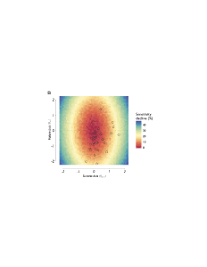
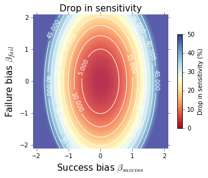

# A python-toolbox for modelling inter-trial dependencies in psychophysical data ##

** More information at www.mackelab.org/code **

This repository contains code to reproduce the analyses in
Fründ, Wichmann, Macke (2014): Quantifying the effect of inter-trial dependence on perceptual decisions. J Vis, 14(7): 9.

The repository is organized as follows:
* *intertrial* is a folder that contains an actual python library that can do  the relevant computations. You can use this library to analyze your own data.
* *data* contains the data that were used in the paper
* *examples* contains working code examples.

This code reproduces the analyses in the paper

    Fründ, Wichmann, Macke (2014): Quantifying the effect of inter-trial dependence on perceptual decisions. J Vis, 14(7): 9.
    
Copyright (C) 2014 Ingo Fründ

## Updated by Anke Braun and Anne Urai, 2017: Additional functionality ##

The code as originally provided by Fründ et al  is adapted to allow for a modulatory term, that on a trial-by-trial basis interacts with experimental history.
When the data file contains a sixth column, this will be taken as a modulation factor (e.g. pupil) and multiplied with response and stimulus history at every lag.
Figures display both the main history kernels and the interaction kernels.

## Updated by Jakob Macke, 2016: Additional theory on Abrahamyan et al ##

Abrahamyana et al recently published an article on  ``Adaptable history biases in human perceptual decisions''

(Arman Abrahamyan, Laura Luz Silva, Steven C. Dakin, Matteo Carandini, and Justin L. Gardner; Adaptable history biases in human perceptual decisions, PNAS).

In addition to showing that history biases are adaptable, they used simulations to relate the strength of history bias to the resulting drop in visual sensitivity. 
We were excited to see this, because our theoretical results on the relationship between history bias and drop in sensitivity precisely capture (and, indeed, predict) their results-- 
see my [notebook](https://bitbucket.org/mackelab/serial_decision/src/c0987ae8044ecd8e57a412eb6765ff14af3c55b5/theory_AGC/SerialDepContour.ipynb?at=master) for full details:

Simulation results by Abrahamyan et al: 

Our theoretical predictions:

## Collection of references on serial dependence ##

Please also see the accompanying [wiki](https://bitbucket.org/mackelab/serial_decision/wiki) which also includes an (editable) list of references on serial dependence. Please add any additional papers 
on this subject (including your own...) directly to that list.

See [https://bitbucket.org/mackelab/home](https://bitbucket.org/mackelab/home) for more repositories by the group.

    Permission is hereby granted, free of charge, to any person obtaining a copy of this software and associated documentation files (the "Software"), to deal in the Software without restriction, including without limitation the rights to use, copy, modify, merge, publish, distribute, sublicense, and/or sell copies of the Software, and to permit persons to whom the Software is furnished to do so, subject to the following conditions:

    The above copyright notice and this permission notice shall be included in all copies or substantial portions of the Software.

    If you use the Software for your own research, cite the paper.

    THE SOFTWARE IS PROVIDED "AS IS", WITHOUT WARRANTY OF ANY KIND, EXPRESS OR IMPLIED, INCLUDING BUT NOT LIMITED TO THE WARRANTIES OF MERCHANTABILITY, FITNESS FOR A PARTICULAR PURPOSE AND NONINFRINGEMENT. IN NO EVENT SHALL THE AUTHORS OR COPYRIGHT HOLDERS BE LIABLE FOR ANY CLAIM, DAMAGES OR OTHER LIABILITY, WHETHER IN AN ACTION OF CONTRACT, TORT OR OTHERWISE, ARISING FROM, OUT OF OR IN CONNECTION WITH THE SOFTWARE OR THE USE OR OTHER DEALINGS IN THE SOFTWARE.
